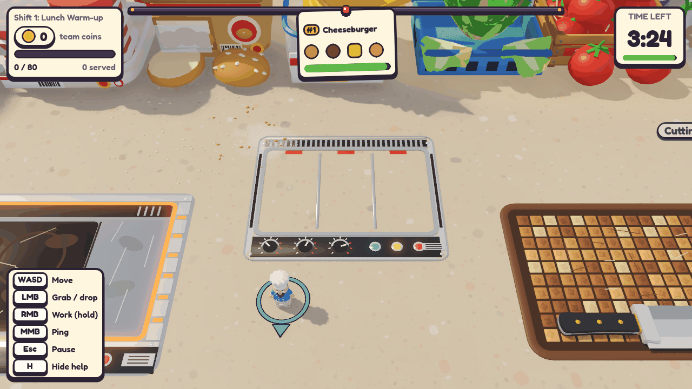
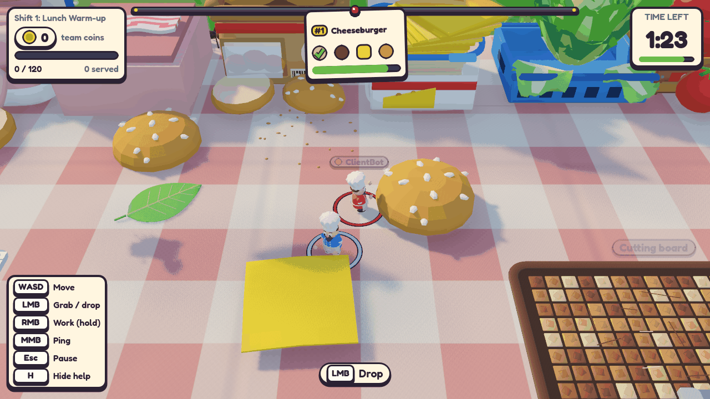
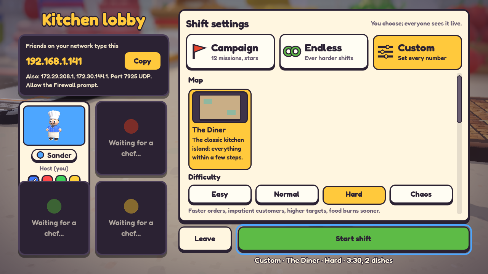
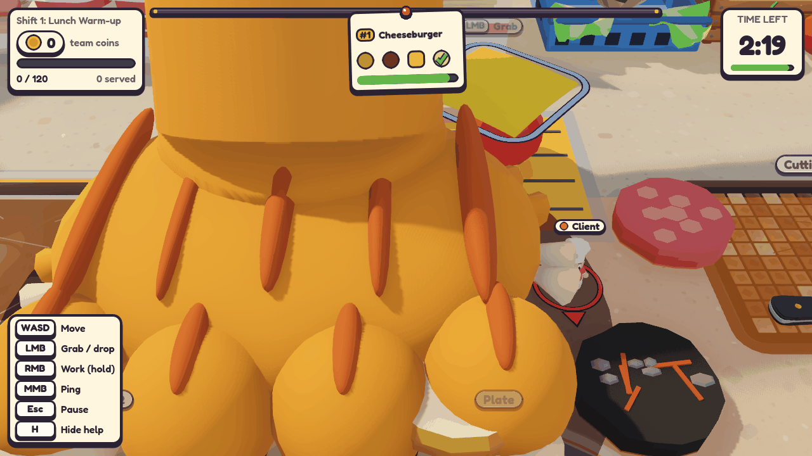

# Tiny Chefs

A cosy co-op kitchen game for 1 to 4 players on a LAN. You are a tiny chef on a giant kitchen counter, the
food is bigger than you are, and the heavy stuff has to be carried together. Cook, stack, serve, and dodge
the cat paw, the wind and the health inspector.

## Play it

Download the single exe from the [Releases](https://github.com/BlackFlow-DK/tiny-chefs/releases) page
(Windows may warn: click **More info**, then **Run anyway**). One player hosts, the others join by IP on the
same network. See the [player guide](docs/PLAYING.md) for hosting, controls, dishes, modes and maps.

## How it was made

Built with Godot 4.7.2 (GDScript) and Blender 5.2. Every model is generated by a Blender Python script in
`art/scripts/`. All code and art were written by Claude Code agents, orchestrated in one session with one
agent per system. For the details see [docs/systems.md](docs/systems.md) and
[docs/design/overnight-1.md](docs/design/overnight-1.md).

## Build it yourself

1. Install Godot 4.7.2 (with export templates) and Blender 5.2.
2. Everything runs from the CLI through the PowerShell wrappers in `tools\`:
   - `tools\blender-run.ps1 art\scripts\<script>.py` regenerates a model
   - `tools\godot-import.ps1` imports assets
   - `tools\godot-check.ps1` parses all scripts and scenes
   - `tools\godot-screenshot.ps1` takes a screenshot of a scene
   - `tools\test-multiplayer.ps1` runs a host plus bot clients
   - `tools\export-windows.ps1` exports `build\windows\<repo-folder>.exe`

Run them as `powershell -NoProfile -ExecutionPolicy Bypass -File tools\<name>.ps1`. [CLAUDE.md](CLAUDE.md)
has the full tool and command-line reference.

## Licence

Not yet chosen.

## Credits

The Fredoka font is used under the SIL Open Font License (OFL).
